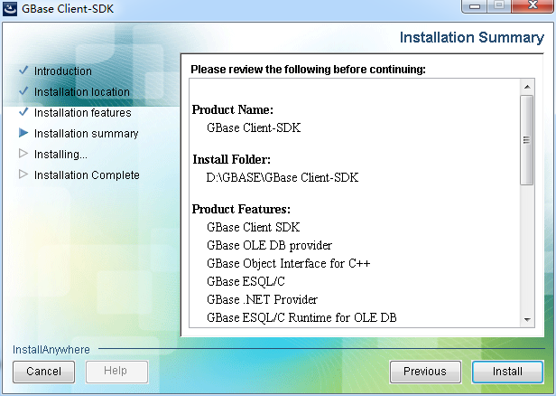

# CSDK安装与配置（Windows）  
本章节将介绍GBase 8s客户端安装部署及相关客户端、ODBC配置。  

## CSDK的安装  
CSDK需要使用管理员权限进行安装。  
下载软件包clientsdk_3.6.3_3X2_1_0ac16b_WIN2003_x86_64.ZIP，请确认软件包是以.ZIP为后缀。  

CSDK安装包解压，以管理员身份运行installclientsdk.exe开始安装。  
  

安装介绍协议页面，需要将滚动条拉到最下面，才可以点击接受协议的单选框。  
 
设置安装路径，这里我们使用D:\GBASE\GBase Client-SDK目录  
    
 
安装的功能浏览，CSDK默认安装的组件包括：OLEDB运行环境、C++接口、ESQL\C、.NET驱动、客户端程序LIBDMI、ODBC驱动、通用数据库工具和GLS。  
    

安装组件预览，执行安装  
  
 
完成安装  
  
 
## CSDK的配置  
安装完成后，需要对客户端连接进行设置。在开始菜单里找到GBase Client-SDK 4.10(64-bit)目录，使用 管理员权限运行 打开Setnet32 程序  
  

在环境（Environment）选项卡，根据数据库的实现情况设置：  
CLIENT_LOCALE：zh_CN.utf8  
DB_LOCALE：zh_CN.utf8  
GBASEDBTSERVER：gbase01  
GBASEDBTDIR: D:\GBASE\GBase Client-SDK  
GL_USEGLU：1  
等参数。  
  
 
在服务器信息（Server Information）选项卡中设置数据库服务器信息：  
HostName：192.168.0.212     主机名或者域名  
Protocolname：onsoctcp      协议名称  
Service Name：13633         数据库使用的端口号  
可以设置为默认的数据库服务器  
  
 
在主机信息（Host Information）选项卡中设置主机信息  
设置用户、密码选项及密码  
  
 
在开始菜单里找到GBase Client-SDK 4.10(64-bit)目录，使用 管理员权限运行 ConnectTest Demo进行连接测试  
  

出现的ConnectTest Demo界面下，会自动加载配置好的数据库服务器信息，  
选择Database（这里我们使用testdb），  
填写测试语句select * from systables进行测试，能获取到数据即为成功。  
 
## ODBC的配置  
安装了64位的CSDK，则需要配置64位的数据源。在 控制面板 – 所有控制面板项 – 管理工具 中配置 数据源（ODBC）开启ODBC配置，添加 用户或者系统DSN  
  

使用GBase ODBC DRIVER (64-bit) 驱动  
  
 
在通用（General）选项卡中，填写数据源名称：testdb  
  
 
在连接（Connection）选项卡中，会读到现有的CSDK连接信息，只需选择相应的DataBase Name，我们这里使用testdb  
    

然后，应用和测试连接  
 
测试连接成功后，在环境（Environment）选项卡中，确认环境是否正确。  
    
 